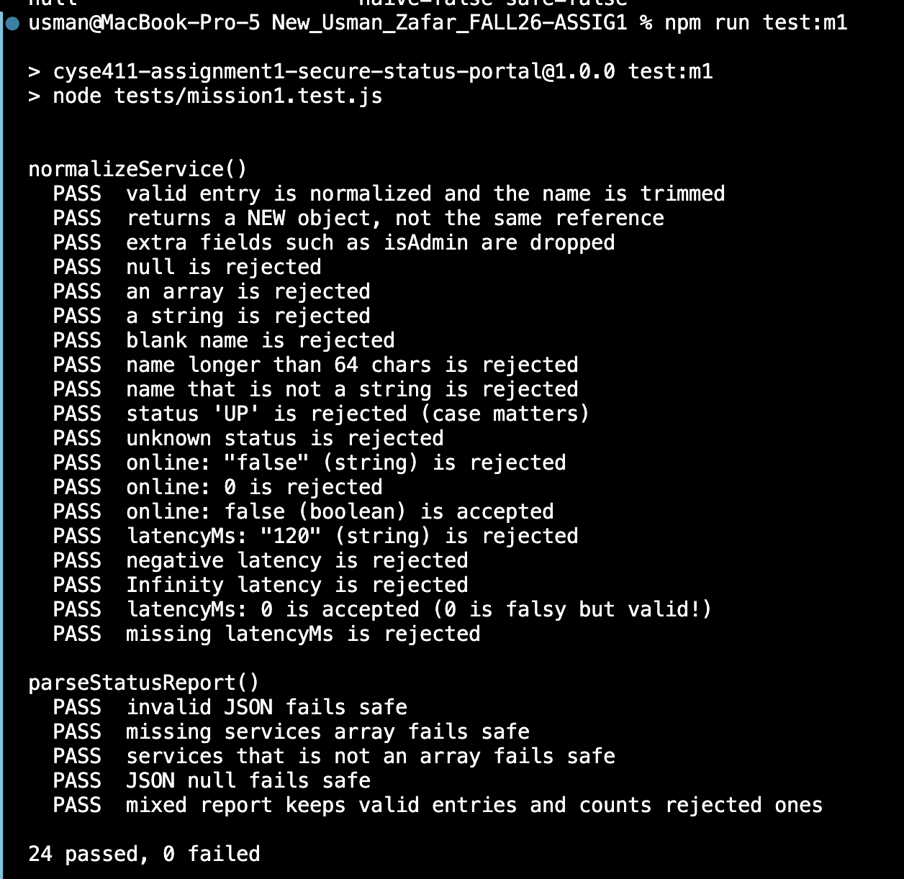

# Mission 1: Python habits that break JavaScript security

## Evidence

Output of `npm run test:m1`, pasted or as a screenshot in `img/`:

```

```

## Connections: Python to JavaScript

For each check you implemented, write how you would do it in Python and how you did it in JavaScript.

| Rule | Python | JavaScript, as in my code |
|---|---|---|

| raw is a dictionary or object, not a list | `isinstance(raw, dict)` |'typeof raw === "object", raw !== null, and !Array.isArray(raw)' | 'isinstance(name, str) and len(name.strip()) > 0'

| name is a non-empty string after trimming |isinstance(name, str) and len(name.strip()) > 0 |typeof raw.name === "string" and raw.name.trim().length > 0|

| status is one of the allowed values |status in ALLOWED_STATUS |ALLOWED_STATUS.includes(raw.status) |

| online is a real boolean | isinstance(online, bool)|typeof raw.online === "boolean" |

| latencyMs is a finite number ≥ 0 | math.isfinite(latencyMs), and latencyMs >= 0| |

| invalid JSON does not crash the program |try/except with json.loads() | try/catch with JSON.parse()|


## Questions

1. Why is `latencyMs: 0` a trap for code such as `if (!raw.latencyMs) return null;`?

   > because 0 is falsy in JavaScript. But latency of 0 is valid but the '!raw.latencyMs' check will be evaluated as True and reject it inappropriately.

2. Your function builds a **new** object and ignores fields like `isAdmin`. Describe in two or three sentences what could go wrong later in an application that copied **every** field it received.

   > if an application copied every field, an attacker could inject some malicious code in a field that grants then unauthorized privileges.

## Documentation log

| Page I used, with URL | One thing I learned from it |
|---|---|
|https://developer.mozilla.org/en-US/docs/Web/JavaScript/Reference/Global_Objects/Array/isArray?utm_source=chatgpt.com| I learned that Array.isArray() checks whether a value is an array.|
