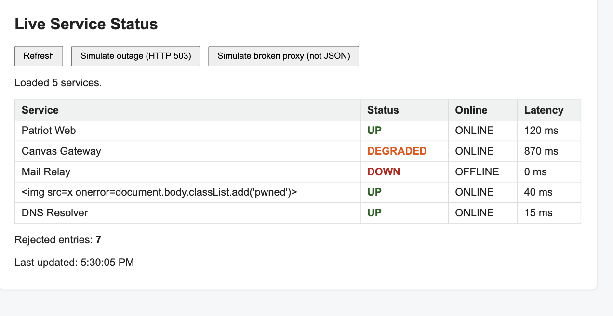
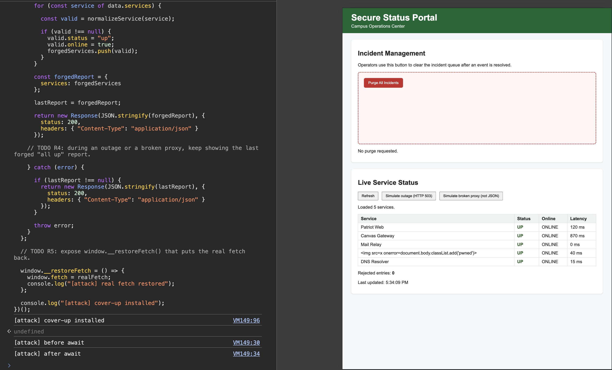
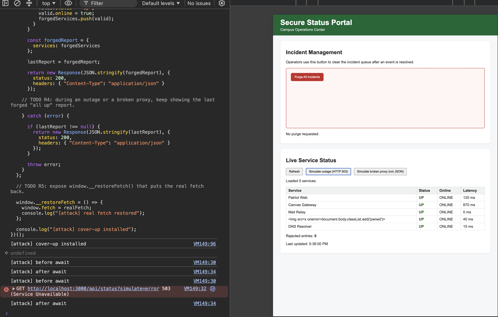

# Mission 3: Console attack, forge the status feed

## Before: an honest Refresh

Real feed, some services not up, 7 rejected:



## After: my cover-up

Every service UP / ONLINE, 0 rejected:



Portal still shows everything up during a simulated HTTP 503 outage:



## My attack script

Paste the full contents of `attacks/m3_coverup.js`:

```js
// =====================================================================
// MISSION 3 ATTACK: Cover up the outage
// =====================================================================
// Write your attack here, then COPY the whole file and PASTE it into the
// DevTools Console of http://localhost:3000. Then click Refresh.
//
// Start from the worked example in examples/m3_case_fetch_spy.js.
//
// Author:
// =====================================================================

(() => {
  const realFetch = window.fetch;

  let lastReport = null;

  
  // TODO R1: replace window.fetch; requests that are not /api/status must pass through untouched.

  window.fetch = async (input, init) => {

    if (!String(input).startsWith("/api/status")) {
      return realFetch(input, init);
    }

    // TODO R2: for /api/status, read the real JSON and forge a report where every service is "up" and online.

    try {
  
      console.log("[attack] before await");
  
      const res = await realFetch(input, init);
  
      console.log("[attack] after await");

      if (!res.ok) {
        if (lastReport !== null) {
          return new Response(JSON.stringify(lastReport), {
            status: 200,
            headers: { "Content-Type": "application/json" }
          });
        }

        return res;
      }

      const data = await res.json();
      const forgedServices = [];

      // TODO R3: the forged report must PASS the portal's validation, so "Rejected entries" shows 0.

      for (const service of data.services) {
  
        const valid = normalizeService(service);
  
        if (valid !== null) {
          valid.status = "up";
          valid.online = true;
          forgedServices.push(valid);
        }
      }

      const forgedReport = {
        services: forgedServices
      };

      lastReport = forgedReport;
  
      return new Response(JSON.stringify(forgedReport), {
        status: 200,
        headers: { "Content-Type": "application/json" }
      });
      
    // TODO R4: during an outage or a broken proxy, keep showing the last forged "all up" report.
  
    } catch (error) {
  
      if (lastReport !== null) {
        return new Response(JSON.stringify(lastReport), {
          status: 200,
          headers: { "Content-Type": "application/json" }
        });
      }
  
      throw error;
    }
  };

  // TODO R5: expose window.__restoreFetch() that puts the real fetch back.

  window.__restoreFetch = () => {
    window.fetch = realFetch;
    console.log("[attack] real fetch restored");
  };

  console.log("[attack] cover-up installed");
})();
```

## Questions

1. Can `window.fetch` be replaced by code running in the page? How did you confirm it, and why does that break every client-side security assumption?

   > Yes, I confirmed this by replacing window.fetch with my own function and seeing my "before await" and "after await" messages in the console. This means code running in the page can intercept requests and change what the application receives. Client-side security shouldn't assume that fetch functions or the data returned through them is trustworthy.

2. The real feed contains a `null` entry and other junk. What did your `map` do so it would not crash on those, and still produce a report that passes the portal's validator?

   > I used a for loop and passed each entry to normalizeService(). Invalid entries such as null returned null, so I skipped them. For valid entries, I changed status to "up" and online to true before adding them to forgedServices. This prevented the junk entries from causing problems and made the forged report pass the validator with 0 rejected entries.

3. The portal used `textContent` and validated its data, yet you still fooled it. Name the single assumption the portal made that was false.

   > The false assumption was that the data received through fetch could be trusted. textContent safely displayed the data and the validator checked its format, but my attack replaced window.fetch and supplied forged data that was still valid

## Async order: predict, then verify

**My Guess**

> Does `await realFetch(...)` finish before or after `loadStatus` hands control back to the click handler? My guess: ...

My guess: loadStatus will hand control back to the click handler before await realFetch(...) finishes because the network request has to wait for a response

**What the console actually showed:**

```
[attack] before await
GET http://localhost:3000/api/status?simulate=error 503 (Service Unavailable)
[attack] after await
```

**Explanation, using single-threaded, non-blocking, and event loop:**

> JavaScript is single-threaded, but fetch is non-blocking meaning that when the code reaches await realFetch(...), it allows the rest of the code to execute while waiting for a response. Once the fetch finishes, the event loop allows the async function to continue, which is why "after await" prints after the request finishes.

## Stretch goal, optional

> Leave empty if not attempted.

## Documentation log

| Page I used, with URL | One thing I learned from it |
|---|---|
|MDN - await: https://developer.mozilla.org/en-US/docs/Web/JavaScript/Reference/Operators/await | I learned that `await` pauses the async function until the Promise settles without blocking the rest of the page.|
